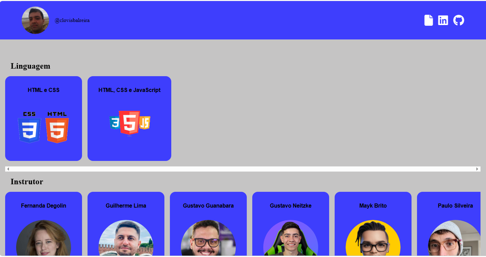

# 💼 Portfólio - Clóvis Balreira Rodrigues

## 📌 Sobre o projeto
Portfólio pessoal desenvolvido para apresentar projetos, habilidades e informações profissionais. O site possui design responsivo e interface interativa, garantindo boa experiência em diferentes dispositivos.

## 🔗 Acesse o projeto
👉 https://clovisbalreira.github.io/portfolio/

## 🚀 Tecnologias utilizadas
- HTML5 (estrutura semântica)
- CSS3 (Flexbox, responsividade, animações)
- JavaScript (manipulação de DOM e interatividade)

## 🎯 Funcionalidades
- Exibição dinâmica de projetos
- Navegação interativa entre seções
- Layout responsivo para mobile e desktop
- Integração com links externos (GitHub, LinkedIn)

## 📷 Preview

## ⚙️ Destaques técnicos
- Uso de JavaScript para criação dinâmica de seções
- Estrutura organizada com classes e objetos
- Aplicação de boas práticas de HTML semântico
- Estilização moderna com variáveis CSS e media queries