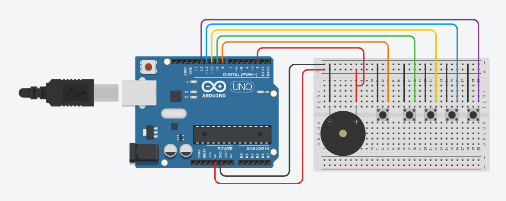
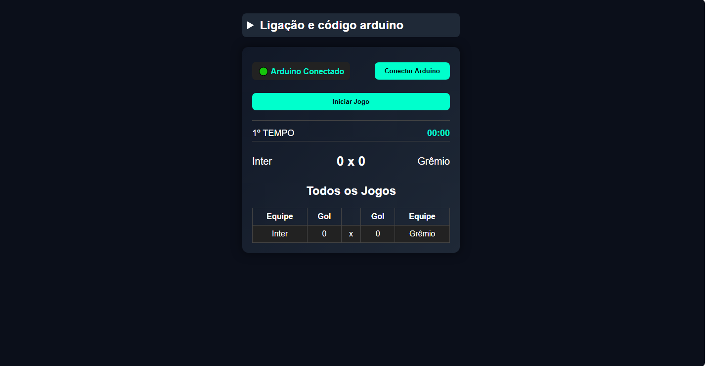

# 🏟️ Placar Eletrônico Interativo com Arduino & Web Serial

Este projeto é um sistema de placar esportivo completo que integra **Hardware (Arduino)** e **Software (Interface Web)** em tempo real.  
Ele permite gerenciar torneios, controlar o tempo de jogo, marcar gols via botões físicos e até anular gols através de um sistema de "VAR".

---

## 🚀 Funcionalidades

### 💻 Interface Web (Dashboard)

- 🔌 **Conexão Direta:** Utiliza a API Web Serial para comunicar com o Arduino diretamente pelo navegador (Chrome/Edge).
- 👥 **Gerenciamento de Equipes:** Adicione de 2 a 12 equipes e gere automaticamente a tabela de jogos.
- ⚙️ **Configuração Personalizada:** Defina o tempo de partida, se o relógio deve ser exibido e a quantidade de jogos simultâneos.
- 🔊 **Feedback Visual e Sonoro:** Animações na tela e alertas sonoros para gols, intervalo e fim de jogo.
- 📊 **Tabela em Tempo Real:** Registro dinâmico de todos os confrontos do dia.

---

### 🤖 Automação Arduino (Firmware)

- 🎮 **Controle Físico:** Botões dedicados para iniciar/passar jogos e marcar gols para até 4 equipes.
- 🧠 **Lógica de VAR (Anulação):** Após um gol, há uma janela de 5 segundos para o adversário anular.
- 🔔 **Buzzer Inteligente:** Alertas sonoros não bloqueantes.
- ⏱️ **Cronômetro de Precisão:** Controle automático de tempo com intervalo e fim de jogo.

---

## 🛠️ Hardware Necessário

| Componente           | Pino Arduino | Descrição                                      |
|---------------------|-------------|-----------------------------------------------|
| Buzzer              | 2           | Alertas sonoros                               |
| Botão Início/Próximo| 8           | Inicia a partida ou avança para o próximo jogo|
| Botão Jogador 1     | 9           | Marca gol para a Equipe A                     |
| Botão Jogador 2     | 10          | Marca gol para a Equipe B                     |
| Botão Jogador 3     | 11          | Marca gol para a Equipe C (se configurado)    |
| Botão Jogador 4     | 12          | Marca gol para a Equipe D (se configurado)    |

> ⚠️ Todos os botões utilizam `INPUT_PULLUP`: conecte um lado ao pino e o outro ao GND.

---

## 🖼️ Imagens do Projeto

### 🔌 Esquema do Arduino

### 💻 Interface Web

---

## 📖 Como Usar

### 1️⃣ Arduino
- Faça o upload do arquivo `arduino.ino` para sua placa (Uno, Mega, Nano, etc).

### 2️⃣ Montagem
- Conecte os botões e o buzzer conforme a tabela de hardware.

### 3️⃣ Interface Web
- Abra o arquivo `index.html` no navegador (Chrome ou Edge).

### 4️⃣ Conexão
- Clique em **"Conectar Arduino"**
- Selecione a porta serial
- Configure o tempo de jogo e número de equipes

### 5️⃣ Execução do Jogo
- Adicione os nomes das equipes
- Clique em **"Criar Jogo"**
- Inicie usando botão físico (pino 8) ou botão na tela
- Marque gols pelos botões físicos
- Para anular: o adversário tem **5 segundos** para apertar o botão

---

## 📡 Protocolo de Comunicação (JSON)

A comunicação entre Arduino e Web é feita via **Serial (9600 baud)** utilizando JSON:

### 🔄 Web → Arduino
- `start`
- `configuracao`
- `equipes`
- `reset_gols`

### 🔁 Arduino → Web
- `gol_anulado`
- `intervalo`
- `fim_jogo`
- Atualizações contínuas de tempo e placar

---

## 🌐 Requisitos

- Navegador compatível com **Web Serial API**
  - ✅ Google Chrome
  - ✅ Microsoft Edge
- Arduino conectado via USB

---

## 🧩 Arquitetura do Sistema

- Interface Web envia comandos via Web Serial
- Arduino processa eventos físicos (botões)
- Comunicação via JSON em tempo real
- Atualização contínua da interface

## ⚠️ Desafios enfrentados

- Sincronização entre hardware e interface web
- Implementação de comunicação serial estável
- Tratamento de eventos em tempo real

## 📌 Observações

- O projeto funciona **100% offline**
- Ideal para:
  - Campeonatos amadores
  - Escolas
  - Eventos esportivos

---

## 👨‍💻 Autor

Desenvolvido por você 🚀  
Se quiser, você pode adicionar aqui seu GitHub ou LinkedIn.

---

## ⭐ Contribuição

Sinta-se à vontade para:
- Abrir issues
- Sugerir melhorias
- Enviar pull requests

---

## 📄 Licença

Este projeto é de uso livre para fins educacionais e pessoais.